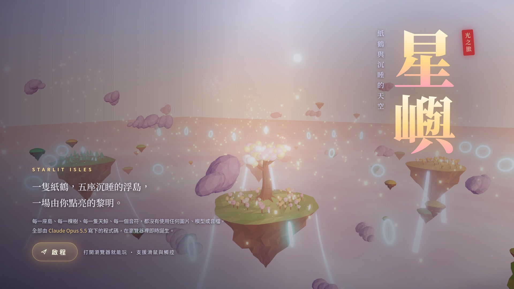

# 星嶼 Starlit Isles

[](trailer/starlit-isles-trailer.mp4)

▶ [觀看宣傳影片（80 秒，1080p60）](trailer/starlit-isles-trailer.mp4)

天空群島沉睡了太久。你是一隻會發光的紙鶴。
收集散落的星種，把光送回每一座浮島，讓整片天空，迎來第一道黎明。

一款在瀏覽器裡飛行的 3D 小品遊戲。整個世界——浮島、樹木、天鯨、雲海、極光，還有配樂與音效——
都沒有使用任何圖片、模型或音檔，全部由程式碼在瀏覽器裡即時生成。

## 怎麼玩

1. 跟著金色星光飛行，收集散落在浮島周圍的星種。
2. 一座島的 8 顆星種收齊後，島上的心燈會亮起一道光柱，飛進光柱就能喚醒這座島：顏色像浪一樣擴散開來，樹木長大、花朵綻放、瀑布開始流動。
3. 櫻、楓、螢、紫苑、金穗五座島都醒來後，飛向中央世界樹頂端的心燈，迎接黎明。

每喚醒一座島，配樂就多一個聲部：低音、琶音、鼓、主旋律，最後是合唱與和聲。
途中可以穿過光環加速、靠近天鯨聽牠們唱歌。結局畫面會揭曉 16 個成就，成就記錄存在瀏覽器裡。

### 操作

| 動作 | 滑鼠／鍵盤 | 觸控 |
|---|---|---|
| 控制方向 | 移動滑鼠，或 WASD／方向鍵 | 在畫面上拖曳 |
| 加速 | 按住左鍵、空白鍵或 Shift | 按住右下角「加速」 |
| 暫停 | P 或 Esc | 右上角暫停鈕 |
| 開關聲音 | M | 右上角喇叭鈕 |

建議開啟聲音，戴耳機更好。

## 在本機執行

遊戲本體是單一檔案 `index.html`。three.js 和字型從 CDN 載入，執行時需要連網。

```sh
python3 -m http.server 8000
# 用瀏覽器打開 http://localhost:8000
```

建議使用最新版 Chrome、Edge 或 Safari。

## 修改遊戲

原始碼依功能拆在 `src/` 裡，改完後執行 `./build.sh`，它會把所有檔案接成新的 `index.html`（同時產生本機測試用的 `test.html`）。

| 檔案 | 內容 |
|---|---|
| `src/00-head.html` | 頁面結構、標題畫面、HUD、結局與暫停畫面的 HTML／CSS |
| `src/01-core.js` | 渲染器、泛光後製、天空（月亮、星星、極光、黎明）、雲海 |
| `src/02-islands.js` | 浮島地形、「甦醒」色彩波材質、樹木與花草 |
| `src/03-props.js` | 心燈與光柱、瀑布、世界樹 |
| `src/04-life.js` | 粒子、螢火蟲、雲朵、天燈、光環、天鯨 |
| `src/05-player.js` | 紙鶴模型與飛行、翅尖光帶、追尾攝影機、星種 |
| `src/06-audio.js` | 生成式配樂與音效（Web Audio） |
| `src/07-game.js` | 遊戲流程、成就、HUD、輸入、主迴圈 |

## 宣傳影片

`trailer/` 裡是製作宣傳影片的工具：導演腳本在無頭 Chromium 裡逐格驅動真正的遊戲畫面，
配樂則是讓遊戲自己的音樂引擎離線算出來，剪接點對齊樂曲的小節線。
重新產生的方法與完整分鏡表見 [`trailer/README.md`](trailer/README.md)。

## 製作

程式碼由 Claude Opus 5.5 撰寫。使用 [three.js](https://threejs.org/) 0.160 與 Noto Serif TC／Noto Sans TC 字型。
